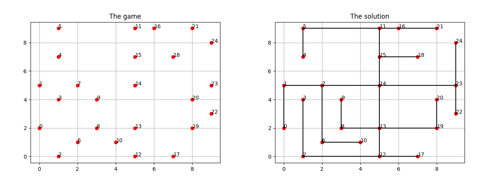

Yashi Game
===============================

This small project aims to automatize the resolution of Yashi Game. Formally, given a set of points on a cartesian coordinate system, the Yashi Game consists in connecting all of them and ending up with a planar spanning tree where each line cannot be a diagonal one. More precisely, the aim is to follow these constraints:

#. no diagonal lines;
#. all points connected;
#. no crossing lines;
#. exactly :math:`n-1` lines must be used, where $n$ is the number of points;
#. no cycles.

    Example of Yashi game

More examples regarding the game can be found in [1]_.

The game can be divided up in three sub-games, one more difficult than the previous:

* P1: state whether a solution exists or not;
* P2: if a solution exists, state how many solutions there are;
* P3: if a solution exists, state a solution with the minimum cost.

In order to solve them I used a mixuture between Graph Theory and SAT. Namely, I used Graph Theory to check whether the initial graph is connected and, if so, to discover all the simple and non-simple cycles exploting the algorithm in [2]_. Afterwards, I used SAT to enforce the no cycles, no crossing lines and :math:`n-1` lines constraints. 

A deeper explanation about the code and solution can be found in the following colab: `https://colab.research.google.com/drive/1TAXalJZJqK_mmszQTmX9zWDElKHTJZQv?usp=sharing <https://colab.research.google.com/drive/1TAXalJZJqK_mmszQTmX9zWDElKHTJZQv?usp=sharing>`_.

Requirements
-----------------
Before running the application be sure to have installed python-sat ([3]_) and matplotlib.

.. code:: console
    
    $ pip install python-sat matplotlib

The recommended python version is :math:`\geq 3.9.0`

Usage
---------
The application can be executed via CLI by running: 

.. code:: console

   $ python main.py --file [FILE] --mode [existence|count|count-plot|best]

where file is the path to the game to solve and mode are criteria to follow in order to solve the game.

The format of the CVS file is the following:

.. code:: text
    
    point,x,y
    ---,---,---

and some examples are located in data directory.

Regarding the mode argument, there are 4 values it can take:

* existence: check and plot the existence of a solution;
* count: if a solution exists, it returns how many solutions there are;
* count-plot: if a solution exists, it returns how many solutions there are and plot each of them;
* best: if a solutions exists, it plots the minimum cost solution printing the cost.

Some examples of valid commands are:

.. code:: console

    $ python main.py --file data/real-yashi-9x9.csv --mode existence
    $ python main.py --file data/no-solution-due-to-crossing-lines.csv --mode existence
    $ python main.py --file data/no-simple-cycles.csv --mode count
    $ python main.py --file data/no-simple-cycles.csv --mode count-plot
    $ python main.py --file data/minimum-cost-solution.csv --mode best

Sitography
---------------

.. [1] `http://www.sumsumpuzzle.com/yashi.htm <http://www.sumsumpuzzle.com/yashi.htm>`_
.. [2] `https://www.codeproject.com/Articles/1158232/Enumerating-All-Cycles-in-an-Undirected-Graph <https://www.codeproject.com/Articles/1158232/Enumerating-All-Cycles-in-an-Undirected-Graph>`_
.. [3] `https://pysathq.github.io/ <https://pysathq.github.io/>`_
